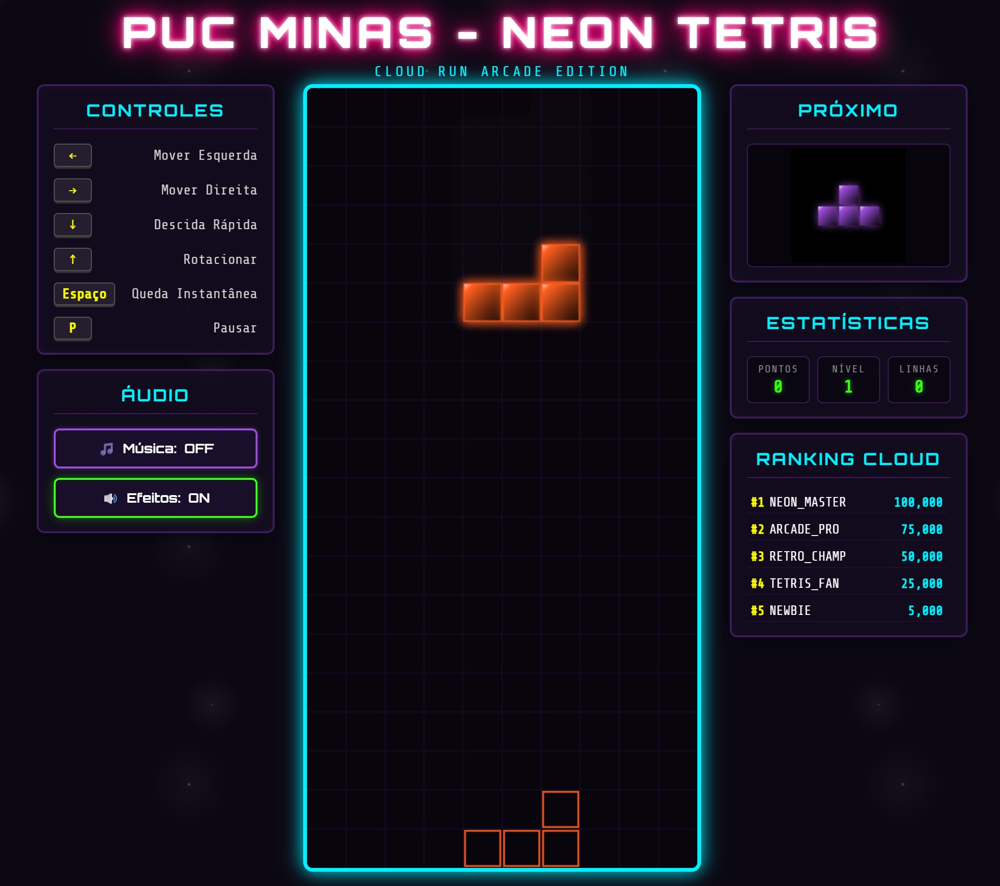

# 🕹️ Retro Neon Tetris — Cloud Run Arcade

Uma versão moderna, estilosa e extremamente sofisticada do clássico jogo **Tetris**, projetada com visual retro-wave/neon (Synthwave) e **Sintetizador de Áudio Procedural** nativo no navegador (usando a Web Audio API).

## 🎨 Interface do Jogo



*Visualização da interface com estilo neon synthwave, exibindo o canvas do jogo (centro), controles (esquerda), próximas peças e estatísticas (direita) com sistema de ranking integrado.*

O projeto é estruturado com um backend assíncrono em **Python (FastAPI)** que gerencia a API de pontuações de recorde (High Scores) persistida em arquivo local, e serve a interface estática do jogo baseada em **HTML5 Canvas, CSS moderno e JavaScript Vanilla**.

Este aplicativo foi planejado e otimizado especificamente para rodar localmente e ser facilmente implantado de forma escalável no **Google Cloud Run (GCP)**.

---

## 🚀 Funcionalidades e Diferenciais
*   **Sintetizador de Áudio Procedural (Web Audio API):** Som clássico de arcade gerado por código diretamente na placa de som do seu computador, dispensando carregamento de arquivos externos `.wav` ou `.mp3`. Conta com efeitos sonoros ao girar peças, limpar linhas, subir de nível e até uma trilha sonora tocada de fundo que pode ser silenciada.
*   **Visual Neon Synthwave:** Efeitos de rastro, sombras glow brilhantes, explosão de faíscas ao limpar linhas e fundo com estrelas animadas via CSS.
*   **Algoritmo Bag-of-7 (Mecânica Justa):** Geração de peças igual à do Tetris oficial de campeonato, garantindo que o jogador não sofra com sequências de azar sem peças fundamentais.
*   **Sistema de Níveis Progressivo:** O nível de dificuldade aumenta a cada 10 linhas removidas, acelerando a queda das peças de forma fluida e aplicando multiplicadores à pontuação.
*   **Tabela de Recordes Integrada (API Cloud):** Salve suas pontuações e envie seu nome em tempo real se superar as pontuações gravadas na nuvem.

---

## 🛠️ Arquitetura do Projeto

```text
├── backend/
│   ├── main.py              # Servidor FastAPI com rotas de API e arquivos estáticos
│   └── requirements.txt     # Dependências de bibliotecas Python
├── static/                  # Pasta com os ativos de frontend servidos pelo FastAPI
│   ├── css/
│   │   └── style.css        # Estilos modernos neon, grade e animações
│   ├── js/
│   │   ├── api.js           # Funções de chamada HTTP assíncronas para o Placar
│   │   └── game.js          # Lógica do jogo, renderização Canvas e sintetizador de som
│   └── index.html           # Esqueleto da página e modais do jogo
├── Dockerfile               # Instruções de montagem da imagem Docker (Cloud Run)
├── .dockerignore            # Exclusão de arquivos desnecessários na imagem Docker
├── .gitignore               # Exclusão de arquivos de versionamento e venv
└── README.md                # Esta documentação completa do projeto
```

---

## 🖥️ Como Executar Localmente (Ambiente Virtual)

Siga os passos abaixo para preparar seu ambiente Python, instalar as dependências necessárias e inicializar o jogo em seu navegador.

### Passo 1: Clonar o Repositório
Primeiro, clone o repositório para a sua máquina local e acesse a pasta do projeto:

```bash
git clone https://github.com/Tiago-TSG/tetris-app-checkpoint-01.git
cd tetris-app-checkpoint-01
```

### Passo 2: Criar o Ambiente Virtual (`venv`)
No diretório raiz do projeto, execute o comando correspondente ao seu sistema operacional para criar o ambiente virtual:

**No Linux / macOS:**
```bash
python3 -m venv venv
```

**No Windows (CMD ou PowerShell):**
```bash
python -m venv venv
```

### Passo 3: Ativar o Ambiente Virtual
Ative o ambiente virtual para que os pacotes sejam instalados isoladamente:

**No Linux / macOS:**
```bash
source venv/bin/activate
```

**No Windows (PowerShell):**
```bash
.\venv\Scripts\Activate.ps1
```

**No Windows (CMD):**
```bash
.\venv\Scripts\activate.bat
```

### Passo 4: Instalar as Dependências
Com o ambiente virtual ativado (indicado pelo prefixo `(venv)` no seu terminal), instale as dependências listadas:

```bash
pip install -r backend/requirements.txt
```

### Passo 5: Executar o Servidor FastAPI
Execute o servidor de desenvolvimento utilizando o `uvicorn`:

```bash
uvicorn backend.main:app --reload --port 8080
```

### Passo 6: Jogar!
Abra seu navegador e acesse:
👉 **[http://localhost:8080](http://localhost:8080)**

---

## 🐳 Como Executar Localmente via Docker

Este projeto possui suporte a contêineres Docker, o que permite rodar toda a aplicação sem precisar instalar o Python ou pacotes de dependências na sua máquina local.

### Passo 1: Clonar o Repositório
Primeiro, clone o repositório para a sua máquina local e acesse a pasta do projeto:

```bash
git clone https://github.com/Tiago-TSG/tetris-app-checkpoint-01.git
cd tetris-app-checkpoint-01
```

### Passo 2: Construir a Imagem Docker
No diretório raiz (onde está o arquivo `Dockerfile`), construa a imagem executando:

```bash
docker build -t tetris-app .
```

### Passo 3: Executar o Contêiner Localmente
Inicialize o contêiner mapeando a porta interna `8080` para a porta `8080` do seu computador local:

```bash
docker run -p 8080:8080 tetris-app
```

Acesse o jogo no navegador através do endereço local **`http://localhost:8080`**.

---

## ☁️ Como Fazer o Deploy no Google Cloud Run

O **Google Cloud Run** é um serviço totalmente gerenciado do GCP que executa contêineres de forma altamente escalável e cobra apenas pelo tempo de processamento utilizado.

### Pré-requisitos
1. Ter uma conta ativa no **Google Cloud Platform (GCP)**.
2. Instalar a ferramenta de linha de comando [Google Cloud CLI (gcloud)](https://cloud.google.com/sdk/gcloud).
3. Ter um projeto criado no GCP e habilitar o faturamento (Billing) e as APIs do Cloud Build e Cloud Run.
4. Clonar este repositório Git em sua máquina local e acessar o diretório do projeto:
   ```bash
   git clone https://github.com/Tiago-TSG/tetris-app-checkpoint-01.git
   cd tetris-app-checkpoint-01
   ```

---

### Opção 1: Deploy Direto via gcloud (Recomendado)
A forma mais rápida e simples de fazer o deploy no Cloud Run é usando o build automático do GCP a partir do seu código-fonte local. O Google Cloud enviará o código, construirá o container na nuvem e fará o deploy em uma única etapa.

1.  Abra seu terminal na raiz do projeto e faça login no Google Cloud:
    ```bash
    gcloud auth login
    ```

2.  Defina o seu projeto padrão do GCP (substitua `NOME-DO-SEU-PROJETO` pelo ID correto do console):
    ```bash
    gcloud config set project NOME-DO-SEU-PROJETO
    ```

3.  Execute o comando de deploy. Ele criará a imagem e a colocará em execução:
    ```bash
    gcloud run deploy tetris-app \
      --source . \
      --region us-central1 \
      --allow-unauthenticated
    ```
    
    > **📝 Nota:** Por padrão, o gcloud criará automaticamente um repositório no **Artifact Registry** com o nome `cloud-run-source-deploy` para armazenar a imagem Docker construída. Você pode visualizá-lo no console do GCP em **Artifact Registry > Repositories**.
    
    *(Você pode alterar a região se desejar, como `southamerica-east1` para o Brasil).*

4.  Ao final do processo, a CLI do gcloud exibirá a **URL pública do jogo** (ex: `https://tetris-app-xxxxx-us-central1.run.app`) no serviço "Cloud Run". Basta abrir no navegador e jogar!

---

### Opção 2: Deploy em Duas Etapas (Via Artifact Registry)
Se você preferir construir a imagem manualmente e enviá-la para um repositório de contêineres próprio do GCP antes de realizar o deploy:

1.  **Criar um repositório no Artifact Registry (caso não possua):**
    ```bash
    gcloud artifacts repositories create neon-arcade-repo \
      --repository-format=docker \
      --location=us-central1 \
      --description="Repositorio para o jogo Tetris"
    ```

2.  **Construir a imagem e enviá-la para o GCP via Cloud Build:**
    Substitua `PROJECT_ID` pelo ID real do seu projeto.
    ```bash
    gcloud builds submit --tag us-central1-docker.pkg.dev/PROJECT_ID/neon-arcade-repo/tetris-app:latest .
    ```

3.  **Realizar o deploy do container armazenado no registro para o Cloud Run:**
    ```bash
    gcloud run deploy retro-neon-tetris \
      --image us-central1-docker.pkg.dev/PROJECT_ID/neon-arcade-repo/tetris-app:latest \
      --region us-central1 \
      --allow-unauthenticated
    ```

---

## 🎮 Controles do Jogo
*   **Seta para Esquerda (`←`) ou `A`:** Move a peça para a esquerda.
*   **Seta para Direita (`→`) ou `D`:** Move a peça para a direita.
*   **Seta para Baixo (`↓`) ou `S`:** Acelera a descida normal da peça (Descida Rápida).
*   **Seta para Cima (`↑`) ou `W`:** Rotaciona a peça em sentido horário.
*   **Barra de Espaço:** Queda instantânea (Dropa o bloco ao fundo e soma pontos bônus).
*   **Letra `P`:** Pausa e despausa o jogo a qualquer momento.

---

## 🔒 Persistência de Dados (Scores) no Cloud Run
Como o Cloud Run funciona sob arquitetura **Serverless Efêmera**, instâncias do contêiner podem ser recicladas, pausadas ou escaladas para zero. 
Nesta configuração padrão, o placar é salvo em um arquivo de texto local chamado `scores.json` dentro do contêiner. Isso significa que se o Cloud Run reduzir as instâncias para zero, o placar retornará aos recordes padrão do jogo (Neon Arcade Master).

*Para uma persistência 100% duradoura em produção na nuvem, você pode facilmente adaptar a função `load_scores` e `save_scores` no arquivo `backend/main.py` para ler e gravar dados em um banco NoSQL gerenciado como o **Google Cloud Firestore**, sem necessidade de alterar o frontend ou as lógicas de jogo.*
